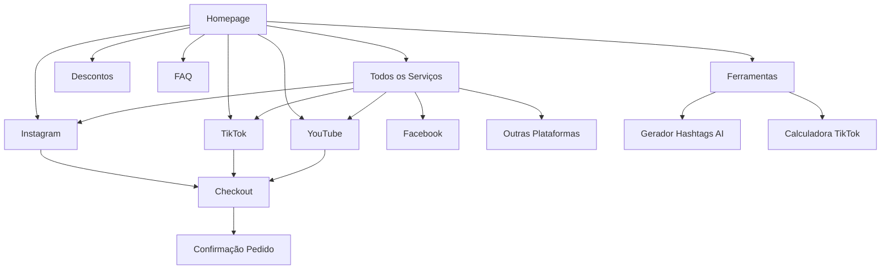

# Documento de Requisitos do Produto - Viralizei

## 1. Product Overview

Viralizei é uma plataforma de crescimento viral orgânico para redes sociais que conecta criadores de conteúdo a uma rede global de influenciadores reais para engajamento autêntico. A plataforma oferece serviços de likes, views, seguidores e comentários através de pessoas reais, eliminando o uso de bots.

- **Problema a resolver**: Crescimento lento e inautêntico nas redes sociais através de métodos tradicionais ou bots
- **Público-alvo**: Criadores de conteúdo, influenciadores, empresas e marcas que buscam crescimento orgânico
- **Valor de mercado**: Democratizar o acesso ao crescimento viral através de uma rede colaborativa de criadores brasileiros e internacionais

## 2. Core Features

### 2.1 User Roles

| Papel | Método de Registro | Permissões Principais |
|-------|-------------------|----------------------|
| Visitante | Acesso direto | Navegar pelo site, visualizar serviços, acessar ferramentas gratuitas |
| Cliente | Checkout direto (sem registro prévio) | Comprar serviços, acompanhar pedidos, acessar suporte |
| Afiliado | Cadastro via formulário | Ganhar comissões, acessar dashboard de vendas |

### 2.2 Feature Module

Nossos requisitos da plataforma Viralizei consistem nas seguintes páginas principais:

1. **Homepage**: seção hero viral, badges dinâmicos de conquistas, serviços populares, depoimentos, features de confiança, FAQ acordeão
2. **Todos os Serviços**: catálogo completo de plataformas, filtros por categoria, cards clicáveis para páginas específicas
3. **Páginas por Plataforma**: Instagram, TikTok, YouTube, Facebook, Threads, Spotify, X/Twitter, Reddit, Twitch, SoundCloud, Outros
4. **Descontos**: programa de lealdade, cupons promocionais, tiers de desconto
5. **FAQ**: categorias organizadas em acordeão, busca por tópicos
6. **Ferramentas**: calculadoras, geradores AI, trackers gratuitos
7. **Checkout**: processo em 3 passos, múltiplas formas de pagamento
8. **Páginas Institucionais**: Carreiras, Contato, Política de Privacidade

### 2.3 Page Details

| Nome da Página | Nome do Módulo | Descrição da Funcionalidade |
|----------------|----------------|----------------------------|
| Homepage | Hero Section | Exibir título viral, subtítulo de rede global, CTA principal "Viralize Agora!" |
| Homepage | Badges Dinâmicos | Simular conquistas em tempo real com timestamps (ex: "1000 Likes Virais - há 25 min") |
| Homepage | Serviços Populares | Mostrar cards das principais plataformas com links para páginas específicas |
| Homepage | Depoimentos | Carousel com 6 reviews de clientes brasileiros fictícios com fotos e @handles |
| Homepage | Features de Confiança | Grid 2x3 com ícones: Entrega 24h, Privacidade, Suporte 24/7, Garantia, Pedido Fácil, Pagamentos Seguros |
| Homepage | FAQ Acordeão | 9 perguntas frequentes expansíveis sobre serviços e plataformas |
| Todos os Serviços | Catálogo de Plataformas | Grid responsivo com 11 cards clicáveis (Instagram, TikTok, YouTube, etc.) |
| Todos os Serviços | Filtros de Categoria | Organizar por tipo de serviço (Seguidores, Likes, Views, Comentários) |
| Instagram | Lista de Serviços | 13 cards com serviços específicos: Seguidores, Likes, Views Reels, Comentários, Stories Views, etc. |
| Instagram | Badges de Qualidade | Indicadores "Premium Disponível", "Entrega Rápida", "High Quality" |
| TikTok | Serviços TikTok | Views, Likes, Seguidores, Comentários, Lives, Shares adaptados para TikTok |
| YouTube | Serviços YouTube | Views, Likes, Inscritos, Comentários, Watch Time, Shares |
| Descontos | Programa de Lealdade | Sistema de tiers: Bronze (5% - R$500), Silver (10% - R$2.500), Gold (15% - R$5.000) |
| Descontos | Cupons Promocionais | Códigos de desconto: R$15 em R$125, R$25 em R$250, R$50 em R$600 |
| FAQ | Categorias Acordeão | 5 seções: Iniciando (6 itens), Confiança & Segurança (2), Pagamentos (3), Entrega (2), Extras (3) |
| Ferramentas | Ferramentas AI Gratuitas | 13 calculadoras e geradores: Hashtags AI, Captions, Contador Seguidores, etc. |
| Checkout | Processo 3 Passos | Escolher Pacote → Inserir Link do Post → Pagamento e Confirmação |
| Checkout | Múltiplos Pagamentos | PagSeguro, Stripe, Apple Pay, Google Pay, Binance Pay (crypto) |
| Header Global | Logo e Rating | Logo "Viralizei" com foguete + "Avaliado 4.9/5 por 200K+ clientes" |
| Header Global | Seletor de Idioma | Toggle PT-BR/EN com flags e textos traduzidos |
| Footer Global | Links Institucionais | Serviços, Descontos, FAQ, Carreiras, Contato, Política de Privacidade |
| Footer Global | Logos de Mídia | Folha, Globo, UOL, Forbes BR, Exame, Bloomberg com link para Yahoo Finance adaptado |
| Carreiras | Header Inspiracional | "Bem-vindo ao Seu Próximo Grande Salto" com cultura remota e valores da empresa |
| Carreiras | Valores da Empresa | 3 pilares: Soluções Reais, Cuidado Genuíno, Mindset de Crescimento |
| Carreiras | Cultura de Trabalho | Remoto 100%, quote de funcionário, flexibilidade total |
| Carreiras | Histórico da Empresa | Estatísticas: 200K+ clientes, 60% recorrentes, crescimento sustentável |
| Carreiras | Benefícios | Flexibilidade horário, R$2.500/ano em cursos, equipamentos fornecidos |
| Carreiras | Processo Seletivo | 5 passos detalhados, email careers@viralizei.com |
| Carreiras | Vagas Abertas | 3 posições: Redator Conteúdo, Especialista SEO, Analista UI/UX Júnior |
| Blog | Artigos de Crescimento | 5 posts iniciais: "Guia TikTok 2025", "Como Viralizar no YouTube", etc. |
| Blog | Categorias | Organizar por plataforma e tipo de conteúdo (guias, dicas, tendências) |
| Rastrear Pedido | Formulário de Status | Campo para ID do pedido, exibir progresso e tempo estimado |
| Minha Conta | Dashboard Cliente | Histórico de pedidos, status atual, recomprar serviços (requer login) |
| Avaliações | Galeria de Reviews | Grid com depoimentos expandidos, filtros por plataforma e rating |
| Multilíngue EN | Homepage Inglês | Tradução completa da homepage para mercado internacional |
| Multilíngue DE | Homepage Alemão | Tradução automática via Google Translate para expansão europeia |
| Checkout Global | Integração Universal | Sistema de checkout em 3 passos disponível em todas as páginas de serviço |
| Analytics | Tracking Avançado | Google Analytics 4 + Facebook Pixel para otimização de conversão |
| SEO | Meta Tags Otimizadas | Títulos e descrições com palavras-chave "comprar likes Instagram viral" |

## 3. Core Process

### Fluxo Principal do Cliente

O usuário acessa a homepage, navega pelos serviços disponíveis, seleciona uma plataforma específica (ex: Instagram), escolhe o tipo de serviço desejado (seguidores, likes, etc.), insere o link do seu post/perfil e finaliza o pagamento em 3 passos simples. Não há necessidade de criar conta - o checkout é direto com acompanhamento via email.

### Fluxo de Navegação

## 4. User Interface Design

### 4.1 Design Style

- **Cores Primárias**: Azul #007BFF (CTAs principais), Verde #28A745 (badges de confiança), Laranja #FF6B35 (botões "Viralize Agora!")
- **Cores Secundárias**: Branco #FFFFFF (fundo), Cinza #F8F9FA (seções alternadas), Preto #212529 (textos)
- **Tipografia**: Inter ou Roboto (sans-serif moderna), tamanhos 16px (corpo), 24px (subtítulos), 32px+ (títulos principais)
- **Estilo de Botões**: Bordas arredondadas (8px), gradientes sutis, hover effects com elevação
- **Layout**: Minimalista vertical, grid responsivo, espaçamento generoso (24px entre seções)
- **Ícones**: SVG coloridos (foguete viral, zap, escudo, estrelas), estilo outline com preenchimento

### 4.2 Page Design Overview

| Nome da Página | Nome do Módulo | Elementos de UI |
|----------------|----------------|-----------------|
| Homepage | Hero Section | Background gradient azul-roxo, título em branco bold 48px, CTA laranja com sombra, animação de partículas |
| Homepage | Badges Dinâmicos | Cards brancos com sombra sutil, ícones coloridos, texto verde para timestamps, animação de fade-in |
| Homepage | Depoimentos | Cards com foto circular 60px, nome em bold, @handle em cinza, estrelas amarelas, aspas decorativas |
| Header Global | Logo e Rating | Logo com ícone foguete SVG laranja, texto "Viralizei" azul bold, rating com estrelas amarelas pequenas |
| Todas as Páginas | CTA Buttons | Fundo laranja #FF6B35, texto branco bold, padding 12px 24px, hover com escurecimento 10% |
| Instagram | Cards de Serviços | Fundo branco, borda cinza clara, ícone Instagram colorido, badges verde/azul, hover com elevação |
| FAQ | Acordeão | Cabeçalho cinza claro, ícone + para expandir, conteúdo com padding interno, transição suave |
| Checkout | Formulário | Campos com borda azul no foco, labels flutuantes, ícones de pagamento coloridos, progress bar azul |

### 4.3 Responsividade

**Mobile-first approach** com breakpoints:
- Mobile: 320px-768px (stack vertical, menu hamburger, CTAs full-width)
- Tablet: 768px-1024px (grid 2 colunas, navegação horizontal compacta)
- Desktop: 1024px+ (grid 3-4 colunas, header fixo, sidebar opcional)

**Otimizações touch**: botões mínimo 44px altura, espaçamento entre elementos clicáveis 8px+, swipe gestures para carousels, scroll suave entre seções.