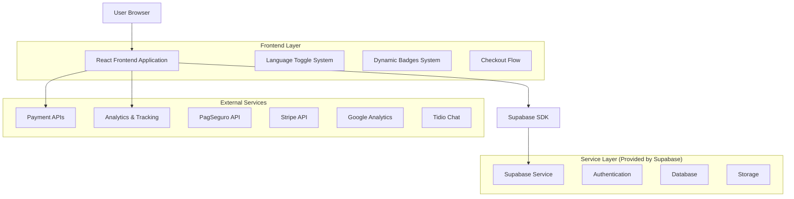
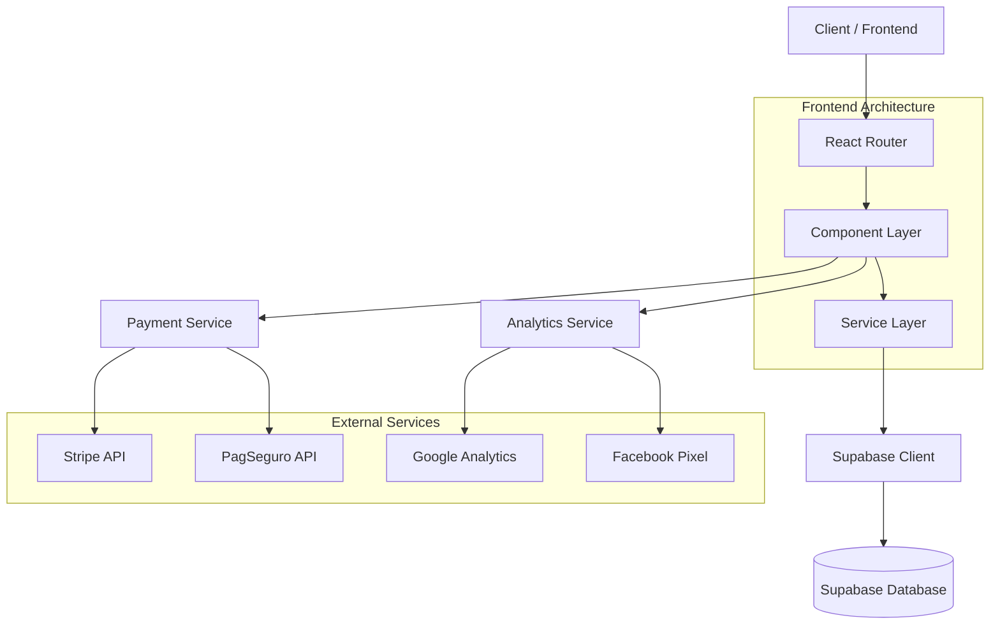
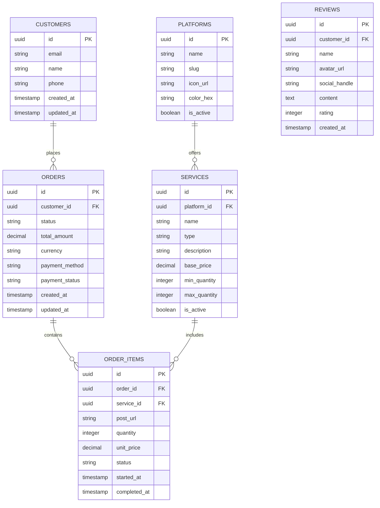

# Documento de Arquitetura Técnica - Viralizei

## 1. Architecture Design



## 2. Technology Description

- **Frontend**: React@18 + TypeScript + TailwindCSS@3 + Vite + React Router DOM
- **Backend**: Supabase (PostgreSQL + Auth + Storage)
- **Styling**: TailwindCSS com configuração customizada para cores da marca
- **Animations**: Framer Motion para transições e badges dinâmicos
- **Icons**: Lucide React para ícones SVG consistentes
- **Forms**: React Hook Form + Zod para validação
- **Payments**: Stripe SDK + PagSeguro SDK + Apple Pay API
- **Analytics**: Google Analytics 4 + Facebook Pixel
- **Internationalization**: React i18next para PT-BR/EN/DE

## 3. Route Definitions

| Rota | Propósito |
|------|-----------|
| / | Homepage principal com hero, badges dinâmicos e serviços populares |
| /todos-os-servicos | Catálogo completo de todas as plataformas disponíveis |
| /instagram | Página específica de serviços Instagram com 13 opções |
| /tiktok | Página específica de serviços TikTok |
| /youtube | Página específica de serviços YouTube |
| /facebook | Página específica de serviços Facebook |
| /threads | Página específica de serviços Threads |
| /spotify | Página específica de serviços Spotify |
| /x-twitter | Página específica de serviços X (Twitter) |
| /reddit | Página específica de serviços Reddit |
| /twitch | Página específica de serviços Twitch |
| /soundcloud | Página específica de serviços SoundCloud |
| /outros | Página para outras plataformas menores |
| /descontos | Programa de lealdade e cupons promocionais |
| /perguntas | FAQ organizado por categorias em acordeão |
| /ferramentas | Ferramentas AI gratuitas (calculadoras, geradores) |
| /carreiras | Página de vagas e cultura da empresa |
| /blog | Blog com artigos sobre crescimento viral |
| /rastrear-pedido | Formulário para acompanhar status do pedido |
| /minha-conta/pedidos | Dashboard do cliente (requer autenticação) |
| /avaliacoes | Galeria de reviews e depoimentos |
| /checkout/:service | Processo de checkout em 3 passos |
| /en | Homepage em inglês |
| /de | Homepage em alemão |

## 4. API Definitions

### 4.1 Core API

**Criação de Pedido**
```
POST /api/orders
```

Request:
| Param Name | Param Type | isRequired | Description |
|------------|------------|------------|-------------|
| service_type | string | true | Tipo de serviço (followers, likes, views, etc.) |
| platform | string | true | Plataforma (instagram, tiktok, youtube, etc.) |
| post_url | string | true | URL do post/perfil para engajamento |
| package_size | number | true | Quantidade solicitada (100, 500, 1000, etc.) |
| customer_email | string | true | Email para acompanhamento |
| payment_method | string | true | Método de pagamento escolhido |

Response:
| Param Name | Param Type | Description |
|------------|------------|-------------|
| order_id | string | ID único do pedido |
| status | string | Status atual (pending, processing, completed) |
| estimated_delivery | string | Tempo estimado de entrega |
| payment_url | string | URL para finalizar pagamento |

**Rastreamento de Pedido**
```
GET /api/orders/:order_id/status
```

**Ferramentas AI**
```
POST /api/tools/hashtag-generator
POST /api/tools/caption-generator
POST /api/tools/engagement-calculator
```

## 5. Server Architecture Diagram



## 6. Data Model

### 6.1 Data Model Definition



### 6.2 Data Definition Language

**Tabela de Clientes (customers)**
```sql
-- Criar tabela
CREATE TABLE customers (
    id UUID PRIMARY KEY DEFAULT gen_random_uuid(),
    email VARCHAR(255) UNIQUE NOT NULL,
    name VARCHAR(100),
    phone VARCHAR(20),
    created_at TIMESTAMP WITH TIME ZONE DEFAULT NOW(),
    updated_at TIMESTAMP WITH TIME ZONE DEFAULT NOW()
);

-- Criar índices
CREATE INDEX idx_customers_email ON customers(email);
CREATE INDEX idx_customers_created_at ON customers(created_at DESC);

-- Permissões Supabase
GRANT SELECT ON customers TO anon;
GRANT ALL PRIVILEGES ON customers TO authenticated;
```

**Tabela de Plataformas (platforms)**
```sql
-- Criar tabela
CREATE TABLE platforms (
    id UUID PRIMARY KEY DEFAULT gen_random_uuid(),
    name VARCHAR(50) NOT NULL,
    slug VARCHAR(50) UNIQUE NOT NULL,
    icon_url TEXT,
    color_hex VARCHAR(7) DEFAULT '#007BFF',
    is_active BOOLEAN DEFAULT true,
    created_at TIMESTAMP WITH TIME ZONE DEFAULT NOW()
);

-- Dados iniciais
INSERT INTO platforms (name, slug, color_hex) VALUES
('Instagram', 'instagram', '#E4405F'),
('TikTok', 'tiktok', '#000000'),
('YouTube', 'youtube', '#FF0000'),
('Facebook', 'facebook', '#1877F2'),
('Threads', 'threads', '#000000'),
('Spotify', 'spotify', '#1DB954'),
('X (Twitter)', 'x-twitter', '#000000'),
('Reddit', 'reddit', '#FF4500'),
('Twitch', 'twitch', '#9146FF'),
('SoundCloud', 'soundcloud', '#FF3300');

-- Permissões
GRANT SELECT ON platforms TO anon;
GRANT ALL PRIVILEGES ON platforms TO authenticated;
```

**Tabela de Serviços (services)**
```sql
-- Criar tabela
CREATE TABLE services (
    id UUID PRIMARY KEY DEFAULT gen_random_uuid(),
    platform_id UUID REFERENCES platforms(id),
    name VARCHAR(100) NOT NULL,
    type VARCHAR(50) NOT NULL, -- followers, likes, views, comments
    description TEXT,
    base_price DECIMAL(10,2) NOT NULL,
    min_quantity INTEGER DEFAULT 100,
    max_quantity INTEGER DEFAULT 10000,
    is_active BOOLEAN DEFAULT true,
    created_at TIMESTAMP WITH TIME ZONE DEFAULT NOW()
);

-- Dados iniciais para Instagram
INSERT INTO services (platform_id, name, type, base_price, min_quantity, max_quantity) 
SELECT p.id, 'Seguidores Instagram', 'followers', 29.90, 100, 5000
FROM platforms p WHERE p.slug = 'instagram';

INSERT INTO services (platform_id, name, type, base_price, min_quantity, max_quantity)
SELECT p.id, 'Likes Instagram', 'likes', 9.90, 50, 2000
FROM platforms p WHERE p.slug = 'instagram';

-- Permissões
GRANT SELECT ON services TO anon;
GRANT ALL PRIVILEGES ON services TO authenticated;
```

**Tabela de Pedidos (orders)**
```sql
-- Criar tabela
CREATE TABLE orders (
    id UUID PRIMARY KEY DEFAULT gen_random_uuid(),
    customer_id UUID REFERENCES customers(id),
    status VARCHAR(20) DEFAULT 'pending' CHECK (status IN ('pending', 'processing', 'completed', 'cancelled')),
    total_amount DECIMAL(10,2) NOT NULL,
    currency VARCHAR(3) DEFAULT 'BRL',
    payment_method VARCHAR(50),
    payment_status VARCHAR(20) DEFAULT 'pending',
    created_at TIMESTAMP WITH TIME ZONE DEFAULT NOW(),
    updated_at TIMESTAMP WITH TIME ZONE DEFAULT NOW()
);

-- Criar índices
CREATE INDEX idx_orders_customer_id ON orders(customer_id);
CREATE INDEX idx_orders_status ON orders(status);
CREATE INDEX idx_orders_created_at ON orders(created_at DESC);

-- Permissões
GRANT SELECT ON orders TO anon;
GRANT ALL PRIVILEGES ON orders TO authenticated;
```

**Tabela de Reviews (reviews)**
```sql
-- Criar tabela
CREATE TABLE reviews (
    id UUID PRIMARY KEY DEFAULT gen_random_uuid(),
    customer_id UUID REFERENCES customers(id),
    name VARCHAR(100) NOT NULL,
    avatar_url TEXT,
    social_handle VARCHAR(100),
    content TEXT NOT NULL,
    rating INTEGER CHECK (rating >= 1 AND rating <= 5),
    is_featured BOOLEAN DEFAULT false,
    created_at TIMESTAMP WITH TIME ZONE DEFAULT NOW()
);

-- Dados iniciais
INSERT INTO reviews (name, social_handle, content, rating, is_featured) VALUES
('João Silva', '@joaoviral', 'Aumentou minha presença online de forma rápida e confiável! Recomendo muito.', 5, true),
('Maria Santos', '@mariasantos_', 'Serviço excelente, seguidores reais e engajamento genuíno. Superou expectativas!', 5, true),
('Pedro Costa', '@pedrocostaoficial', 'Melhor investimento que fiz para meu perfil. Resultados em menos de 24h!', 5, true),
('Ana Oliveira', '@anaoliveira', 'Suporte incrível e entrega conforme prometido. Viralizei mesmo!', 5, true);

-- Permissões
GRANT SELECT ON reviews TO anon;
GRANT ALL PRIVILEGES ON reviews TO authenticated;
```